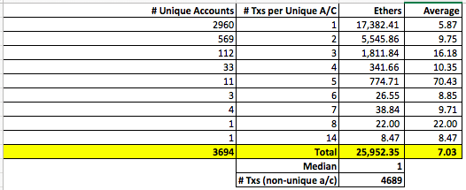
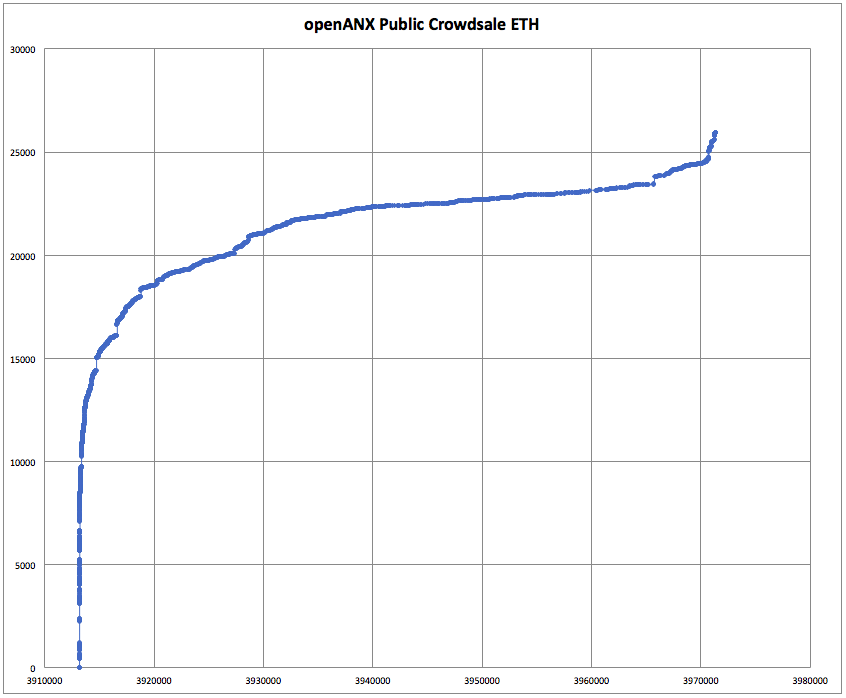
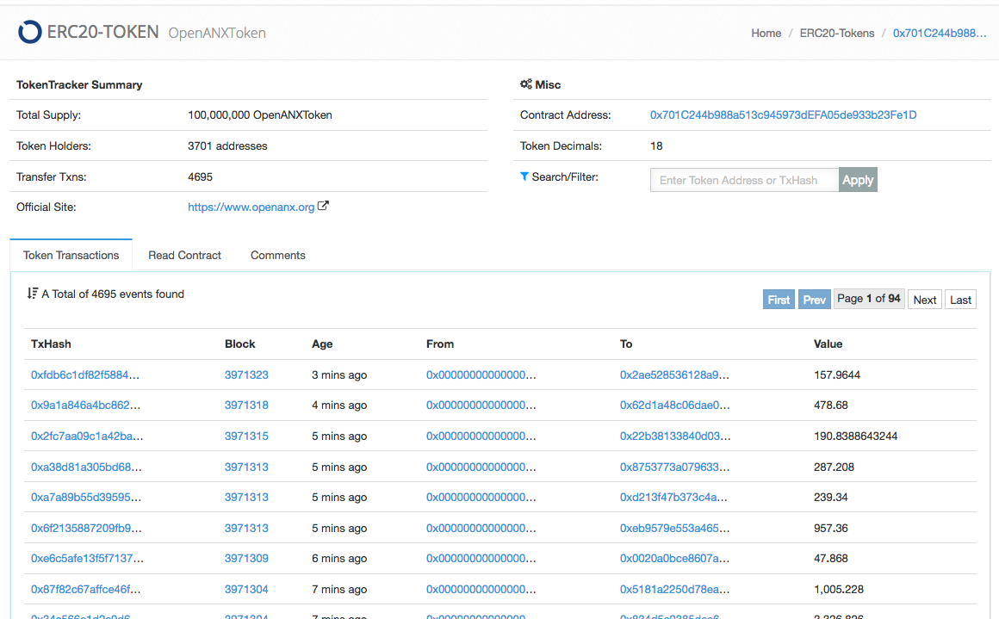
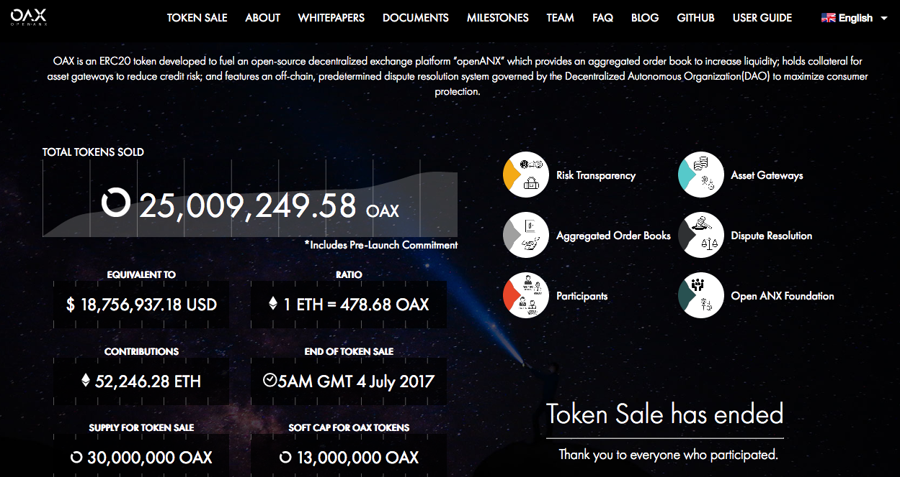

# openANX Decentralised Exchange Token Sale Smart Contract

# *Notice: Further development on the broader project is moved to the [OAX GitLab group](https://gitlab.com/oax)*

Website: [http://openanx.org/](http://openanx.org/)

Whitepaper: [https://www.openanx.org/en/assets/whitepaper/openANX_White_Paper_ENU.pdf](https://www.openanx.org/en/assets/whitepaper/openANX_White_Paper_ENU.pdf)

Reddit: [https://www.reddit.com/r/OpenANX/](https://www.reddit.com/r/OpenANX/)

Slack: [https://openanx.slack.com/](https://openanx.slack.com/)

Bug bounty program: [https://medium.com/@OAX_Foundation/openanx-bug-bounty-program-ccc6e981fd6a](https://medium.com/@OAX_Foundation/openanx-bug-bounty-program-ccc6e981fd6a)

 

# Table of contents

* [Finalised Crowdsale Statistics](#finalised-crowdsale-statistics)
* [Updates](#updates)
* [Requirements](#requirements)
* [TODO](#todo)
* [Operations On The Crowdsale Contract](#operations-on-the-crowdsale-contract)
  * [Anytime](#anytime)
  * [Before Start Date](#before-start-date)
  * [After Start Date And Before End Date Or Finalised](#after-start-date-and-before-end-date-or-finalised)
  * [After Finalised](#after-finalised)
  * [After 1 Year And 2 Years](#after-1-year-and-2-years)
* [Testing](#testing)
* [Deployment Checklist](#deployment-checklist)

 

# Finalised Crowdsale Statistics

The public crowdsale was finalised at Jul-04-2017 05:01:14 AM +UTC, 12 days after the start, in block [3971324](https://etherscan.io/block/3971324) with tx [0xf7ba25c7](https://etherscan.io/tx/0xf7ba25c71bedc47d5237fd0e92cba266e627f32ca0de2946254359fa1dcedd0e).

Following are the statistics for the public contributions to this crowdsale:

<kbd></kbd>

 

Following is a chart of the public contributions to this crowdsale:

<kbd></kbd>

 

Raw data for the statistics above can be found in [scripts/TokensBought_20170704_150051-final.xls](scripts/TokensBought_20170704_150051-final.xls).

 

Following is the [EtherScan token page for openANX](https://etherscan.io/token/0x701C244b988a513c945973dEFA05de933b23Fe1D):

<kbd></kbd>

 

The token distribution at the end of the crowdsale can be found in [scripts/tokenBalancesByAccounts.xls](scripts/tokenBalancesByAccounts.xls). 

 

Statistics from [https://www.openanx.org/en/](https://www.openanx.org/en/):

<kbd></kbd>

 

# Updates

* Jun 19 2017 - **LOW IMPORTANCE** - Jordi Baylina has pointed out that the first part of `require(msg.value > 0 && msg.value >= CONTRIBUTIONS_MIN);` is not necessary. This first part has been removed.
* Jun 20 2017 - **LOW IMPORTANCE** - Darryl Morris has pointed out that `CONTRIBUTION_MIN` and `CONTRIBUTION_MAX` should be marked as **const**. The code has been left as-is.
* Jun 21 2017 - Loi Luu - [openANX Audit](https://gist.github.com/loiluu/a80ba9c6df0d3a18773698644d988969)
* Jun 21 2017 - **LOW IMPORTANCE** - Brian See has pointed out that `PrecommitmentAdded(...)` is not used, as the `Transfer(0x, participant, balance)` provides the same data. The code has been left as-is.
* Jun 21 2017 - Hugh Madden has provided provided the following, and will update the OpenANXToken.sol code or update this rate using `setTokensPerKEther(...)`:

      20 June 2017 23:59:59 eth close data = $359.01
      Price in USD    359.01
      Value of 1k ETH    359010
      price per token    0.75
      tokens per K of ETH    478680

  I have confirmed using an alternate method:

      ETH per token = .75 / 359.01 = 0.002089078
      This is the same as 1 / .002089078 = 478.680000001 OAX per ETH
      tokensPerEther = 478.680000001
      tokensPerKEther = 478,680

* Jun 22 2017 - Darryl Morris - [code review report](https://docs.google.com/document/d/1HBMY3v-_-JGZ9hzzcNYnyMyfQRukfetNifNUr57MW8g/edit) with [local copy](audits/DarrylMorris_OpenANXOAXContractCodeReview_20170622.pdf). From his review, Darryl has also reported to the Solidity team bug [#2441 Address literals not being treated as "compile-time constant"](https://github.com/ethereum/solidity/issues/2441) as [`address public TRANCHE2_ACCOUNT = 0xBbBB34FA53A801b5F298744490a1596438bbBe50;`](https://github.com/openanx/OpenANXToken/blob/master/contracts/LockedTokens.sol#L33) could not be set as a constant.
* Jun 22 2017 - OpenANXToken deployed to [0x701c244b988a513c945973defa05de933b23fe1d](https://etherscan.io/address/0x701c244b988a513c945973defa05de933b23fe1d#code), LockedTokens address is [0x3866259bc60e5b69d5c438db238d3b4c9db37bcb](https://etherscan.io/address/0x3866259bc60e5b69d5c438db238d3b4c9db37bcb#code) and wallet at [0x2b3b67c6dffc2bcdda2315491eac9bbe868fbcdd](https://etherscan.io/address/0x2b3b67c6dffc2bcdda2315491eac9bbe868fbcdd)
* Jul 04 2017 - Hugh Madden executed the `finalise()` function in transaction [0xf7ba25c7](https://etherscan.io/tx/0xf7ba25c71bedc47d5237fd0e92cba266e627f32ca0de2946254359fa1dcedd0e) at Jul-04-2017 05:01:14 AM +UTC.

 

# Requirements

* Token Identifier
  * symbol `OAX`
  * name `openANX Token`
  * decimals `18`

* Tranche 1 30,000,000 (30%) OAX Crowdsale Dates
  * START_DATE = 1498136400 Thursday, 22-Jun-17 13:00:00 UTC / 1pm GMT 22 June 2017
  * END_DATE = 1500728400 Saturday, 22-Jul-17 13:00:00 UTC / 1pm GMT 22 July 2017

* Total of 100,000,000 OAX tokens
  * Tranche 1 30,000,000 (30%) OAX Crowdsale
    * Soft cap of 13,000,000 OAX (ETH equivalence of USD 9,750,000)
    * Hard cap of 30,000,000 OAX (ETH equivalence of USD 22,500,000)
    * Tokens from precommitments funded via fiat and other currencies will be included in this tranche 
  * Tranche 2 30,000,000 (30%) OAX - locked for 1 year from token launch for Additional Token Sale (ATS)
    * 30,000,000 Tranche 2 token sale - Additional Token Sale (ATS). These tokens are subject to a lock-up for 1 year from token launch
  * 20,000,000 (20%) OAX retained by the foundation, locked for 2 years from token launch
  * 20,000,000 allocated to founding supporters (directors, advisors and early backers) of the foundation, consisting of:
    * 14,000,000 (70%) locked for 1 year from token launch
    * 6,000,000 (30%) locked for 2 years from token launch

* OAX Token Price
  * The price for an OAX token will be set as the equivalence of USD 0.75 ETH based on ETH/USD @ 12:00 GMT Jun 21 2017
  * The indicative price per OAX token is 0.00290923 ETH as of 8 June 2017
    * 1 OAX = 0.00290923 ETH
    * 1 ETH = 1 / 0.00290923 = 343.733565238912015 OAX
  * This will be encoded as an unsigned integer, 1,000 ETH = 343734 OAX with six significant figures
      tokensPerKEther = 343734

* Precommitments
  * Some participants will be able to purchase the crowdsale tokens through precommitments using fiat and other currencies
  * openANX will allocate the tokens for these participants prior to the public crowdsale commencement 

* Minimum Funding And Refunds
  * There is no minimum funding level in the smart contract as the precommitments already exceed the minimum funding level
  * There is therefore no requirements for this crowdsale contract to provide refunds to participants
    * ETH contributed to the crowdsale smart contract will be immediately transferred into a wallet specified by openANX

* Crowdsale Wallet
  * The wallet receiving the ethers during the crowdsale has to be specifed as a parameter during the deployment of the crowdsale contract
  * This wallet address can be changed at any time during the crowdsale period

* Minimum and Maximum Contributions
  * There is the ability to set a minimum and maximum contribution per transaction. Set one or both of these to 0 if this restriction is not required

* Soft And Hard Cap
  * There will be a soft cap and a hard cap specified in the crowdsale smart contract
  * openANX will be able to execute the `finalise()` function to close the crowdsale once the number of issued tokens exceeds the soft cap
  * openANX will also be able to execute the `finalise()` function after the crowdsale end date if the soft cap is not reached

* `finalise()` The Crowdsale
  * openANX calls `finalise()` to close the crowdsale, either after the soft cap is breached to the end of the crowdsale period, or after the crowdsale end date 
  * The `finalise()` function will allocate the 1 and 2 year locked tokens, unsold tranche1 tokens and tranche2 tokens

* KYC
  * Participants can contribute to the crowdsale by sending ETH to the OAX 'openANX Token' smart contract and will be issued OAX tokens
  * Participants will only be able to transfer their issued OAX tokens after being successfully KYC verified by openANX and unless otherwise agreed by Open ANX Foundation, in no circumstance shall such transfer be possibly prior to the Release Date scheduled for July 29th (being one week after the scheduled end of the  Contribution Window).
  * There will be no refund if the KYC verification is determined to be unsuccessful
  * The KYC smart contract will just encode a simple Yes/No on an accounts KYC status
  * Once KYC approved, an account cannot be KYC disapproved
  * OAX tokens are otherwise able to be transferred freely without further KYC requirements 

* Unsold Tranche 1 Tokens
  * Any tokens unsold from the tranche 1 quota will be locked away for 1 year along with the tranche 2 tokens

* Locked Tokens
  * Accounts holding 1 or 2 year locked tokens will also be able to participant in the public crowdsale

* Burn function
  * [ ] Work out who can burn the tokens - owner only, or anyone

 

## TODO

* [x] BK Complete KYC functions
* [x] BK Testing different scenarios
  * [x] Scenario where funding below soft cap and above soft cap
  * [x] Unlocking of tokens in 1 year and 2 years
  * [x] Public crowdsale participant can also have locked tokens
* [x] BK Add functions in the main contract to query the locked balances for accounts
* [x] BK Develop and test token contract upgrade path
* [x] BK Develop test membership contract to test users burning tokens for membership
* [ ] BK Complete [Security Audit](SecurityAudit.md).
* [ ] JB Security audit

 

# Operations On The Crowdsale Contract

Following are the functions that can be called at the different phases of the crowdsale contract

## Anytime

* Owner can call `setWallet(...)` to set the wallet address

* Owner can call `kycVerify(...)` to verify participants, but this should be done after the crowdsale as the participants can transfer tokens immediately after being verified

## Before Start Date

* Owner can call `setTokensPerKEther(...)` to set the token issuance rate
* Owner can call `addPrecommitment(...)` to add precommitment balances

## After Start Date And Before End Date Or Finalised

* Participants can send ETH to the default `()` function and receive tokens
* Owner can call `finalise()` if soft cap breached or we are past the end date

## After Finalised

* Owner calls `kycVerify(...)` to verify participants, but this should be done after the crowdsale as the participants can transfer tokens immediately after being verified
* Participant can call the normal `transfer(...)`, `approve(...)` and `transferFrom(...)` to transfer tokens

## After 1 Year And 2 Years

* Participants with locked tokens can called the `lockedTokens.unlock1Y()` and `lockedTokens.unlock2Y()` to unlock their tokens
  * Find the address of the LockedTokens contract from the lockedTokens variable in the token contract
  * Watch the LockedTokens address using the LockedTokens Application Binary Interface
  * Execute `unlock1Y()` after 1 year has passed, or `unlock2Y()` after 2 years has passed, to unlock the tokens

 

# Testing

See [test](test) for details.

 

# Deployment Checklist

* Check START_DATE and END_DATE
* Check Solidity [release history](https://github.com/ethereum/solidity/releases) for potential bugs 
* Deploy contract to Mainnet with specified wallet address as the deployment parameter
* Verify the source code on EtherScan.io
  * Verify the main openANXToken contract
  * Verify the LockedToken contract

 

 

Enjoy. (c) OpenANX and BokkyPooBah / Bok Consulting Pty Ltd 2017. The MIT Licence.
